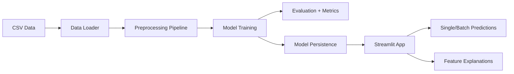
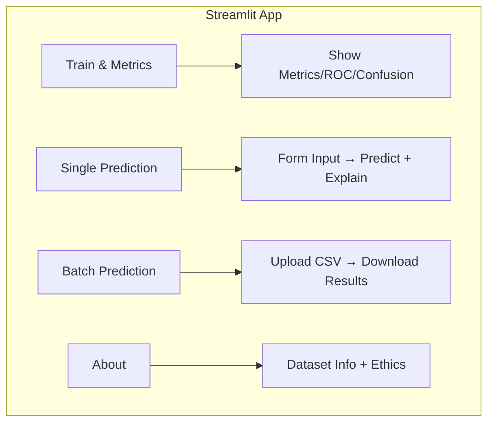

# Loan Approval Prediction Application

A complete machine learning application for predicting loan approval status using scikit-learn and Streamlit.

## Data Flow Diagram



## App Flow Diagram



---

## Quick Start

### 1. Setup Environment

```powershell
# Navigate to project directory
cd d:\projects\muza_projects\pbl4

# Install UV if not already installed
pip install uv

# Install dependencies (creates .venv automatically)
uv sync

# Activate virtual environment (Windows PowerShell)
.\.venv\Scripts\Activate.ps1
```

### 2. Download Dataset

1. Go to [Kaggle Loan Prediction Dataset](https://www.kaggle.com/datasets/altruistdelhite04/loan-prediction-problem-dataset)
2. Download `train.csv`
3. Place it in `data/raw/train.csv`

### 3. Train the Model

```powershell
python -m src.train
```

### 4. Run Evaluation (Optional)

```powershell
python -m src.evaluate
```

### 5. Launch Streamlit App

```powershell
streamlit run main.py
```

The app opens at http://localhost:8501

---

## Project Structure

```
pbl4/
├── README.md
├── requirements.txt
├── .gitignore
├── data/
│   ├── raw/              # Place Kaggle CSV here (not committed)
│   └── sample_input.csv  # Sample for batch prediction demo
├── models/
│   ├── loan_model.joblib     # Trained model pipeline
│   └── model_metadata.json   # Training metadata
├── src/
│   ├── __init__.py
│   ├── config.py         # Configuration constants
│   ├── data_loader.py    # Data loading utilities
│   ├── preprocessing.py  # sklearn preprocessing pipeline
│   ├── train.py          # Model training
│   ├── evaluate.py       # Metrics and evaluation
│   ├── predict.py        # Prediction utilities
│   ├── explain.py        # Feature importance
│   ├── i18n.py           # Translations (EN, UZ, RU)
│   └── utils.py          # Shared utilities
├── main.py               # Streamlit UI (run this)
└── COURSEWORK_GUIDE.md   # Student presentation guide
```

---

## Presentation Notes

### Problem Statement
Loan approval is a critical decision for financial institutions. Manual review is time-consuming and may be inconsistent. This application uses machine learning to predict loan approval based on applicant characteristics.

### Approach
1. **Data Loading**: Load CSV, convert target (Y/N → 1/0), drop ID column
2. **Preprocessing**: Handle missing values, encode categorical features
3. **Model Selection**: Compare Logistic Regression (baseline) vs Random Forest (strong)
4. **Evaluation**: Use cross-validation, classification report, confusion matrix, ROC-AUC

### Preprocessing Pipeline
- **Numeric features**: Impute median, standardize (StandardScaler)
- **Categorical features**: Impute most frequent, OneHotEncode with `handle_unknown="ignore"`
- All preprocessing inside sklearn Pipeline to prevent data leakage

### Model Selection
- 5-fold stratified cross-validation
- Compare mean accuracy
- Select best model automatically
- Default: RandomForest typically outperforms Logistic Regression

### Evaluation Results
After training, the model achieves approximately:
- **Accuracy**: ~80-82%
- **ROC-AUC**: ~0.75-0.80
- Credit history is typically the most important feature

### How to Demo Live
1. Launch Streamlit app
2. Show "Train & Metrics" tab - train model, show confusion matrix and ROC curve
3. Show "Single Prediction" - fill form, predict, show feature importance
4. Show "Batch Prediction" - upload sample CSV, download results
5. Show "About" - discuss limitations and ethical considerations

---

## Limitations

1. **Dataset Size**: ~600 samples is small for production ML
2. **Class Imbalance**: More approvals than rejections
3. **Missing Features**: Real-world would include credit score, employment history
4. **No Temporal Validation**: No time-based train/test split
5. **Binary Classification**: Does not predict loan amount or interest rate

## Ethical Considerations

> [!WARNING]
> This is a coursework demonstration, NOT for production use.

- **Fairness**: Model may learn biases present in historical data
- **Transparency**: Important to explain predictions to applicants
- **Regulation**: Real loan decisions must comply with fair lending laws
- **Human Oversight**: ML should assist, not replace, human judgment

---

## Smoke Test

Verify the model loads and predicts correctly:

```powershell
python -m src.predict --smoke-test
```

---

## License

Coursework project - for educational purposes only.
